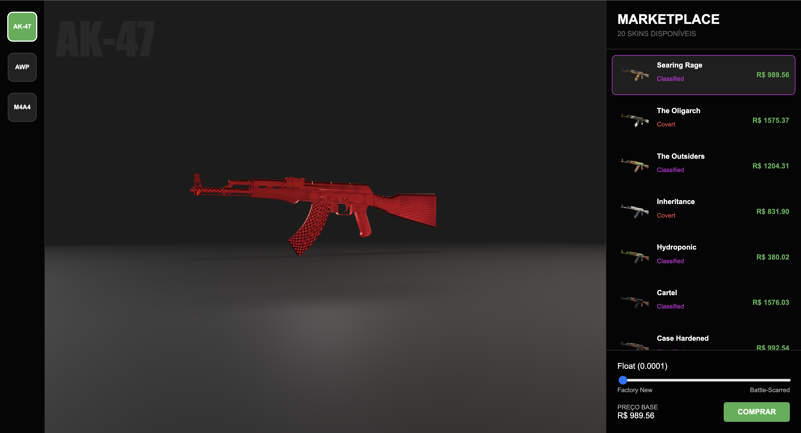

<div align="center">

<p align="center">

</p>

<h1 align="center">

</h1>

<p align="center">
<strong>A Próxima Geração de Visualizadores de Skins: Performance e Fidelidade Gráfica.</strong>
</p>

<p align="center">


</p>

</div>

---

## 🎯 Sobre o Projeto

O **Skynex CS2 Inventory Viewer** é um projeto de simulação de mercado e inspeção de skins em tempo real, demonstrando proficiência em **gráficos 3D no navegador**, **PBR materials**, **animações**, e **consumo de APIs externas**.

Ele recria a experiência de inspeção do Counter-Strike 2, permitindo ao usuário:

- Alternar armas (AK-47, AWP, M4A1-S)
- Visualizar modelos 3D realistas
- Ajustar o **Float Value** e observar seu impacto no desgaste da skin
- Carregar skins e dados de uma API externa
- Vivenciar uma interface moderna com animações suaves

---

## ✨ Destaques Técnicos

| Feature | Descrição | Tecnologia |
|--------|-----------|------------|
| **Renderização 3D** | Modelos `.glb` com alta performance no navegador | React Three Fiber / Three.js |
| **Material Simulado** | Simulação de brilho metálico, roughness e desgaste | PBR / Float Value Logic |
| **Consumo de Dados** | Listagem dinâmica de skins através de API externa | fetch API |
| **Float Slider** | Desgaste em tempo real alterando shaders do material | React useState / Three.js |
| **UX Cinematográfico** | Transições e landing page com parallax | Framer Motion |

---

## 📸 Screenshots & Showcase

| Tela | Imagem |
|------|----------------|
| **Landing Page** |  |
| **Card** |  |
| **Inspeção 3D** |  |

---

## 🛠️ Instalação e Execução

### 📌 Pré-requisitos

- **Node.js 16+**

---

### 1. Clonar e Instalar

```bash
# 1. Clone o repositório
git clone https://github.com/gabrielbeloni06/Skynex
cd cs2-market

# 2. Instalar dependências
npm install
